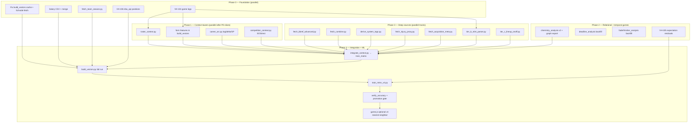

# Vector Hoops — Holistic Data Expansion Workflow

> **Status:** Active (2026-07-05)  
> **Goal:** Train MTNN v4 with environment-aware player embeddings for Chimera, Chemistry, Deadline, Fall, and cross-era comparison games.  
> **Doctrine:** Every feature is era-z-scored, mask-honest, source-cited, and limitations-stated before any game surface uses it.

---

## Dynamic workflow (DAG)



**Parallel lanes:** P0 tasks have no cross-deps. P1 starts when VH-101 has ≥1 season OR vectors.json exists (roster approximations). P3 deep tracks are independent until `integrate_context.py`. P4 is sequential.

---

## Phase 0 — Foundation (Week 1)

### 0.1 VH-101 Game logs `pipeline/fetch_gamelogs.py`
| Step | Action | Owner | Done when |
|------|--------|-------|-----------|
| 0.1.1 | Run fetcher for 2015-26; resume from partial files | claude | `gamelogs_*.jsonl` ≥10MB each |
| 0.1.2 | Add `--season`, `--offline`, retry/backoff matching build_vectors | cursor | CLI parity |
| 0.1.3 | Backfill 2000-2014 in batches (lower priority) | claude | manifest lists seasons |
| 0.1.4 | Commit derived aggregates only; raw stays gitignored | cursor | `.gitignore` verified |

### 0.2 Full wide matrix `pipeline/build_vectors.py`
| Step | Action | Owner | Done when |
|------|--------|-------|-----------|
| 0.2.1 | Legacy cache alias (`base_*` → `dashbase_*`) | cursor | ✅ shipped |
| 0.2.2 | Fetch Advanced, Scoring, Bio, Tracking per season | claude | cache `dashadvanced_*` etc. |
| 0.2.3 | Wire FORM_FEATURES from game logs | cursor | manifest includes form cols |
| 0.2.4 | Full run → `train_matrix.npz` with ≥40 wide features | claude | `feature_manifest.json` |

### 0.3 Salary `pipeline/fetch_salaries.py` + merge
| Step | Action | Owner | Done when |
|------|--------|-------|-----------|
| 0.3.1 | Schema + example CSV | cursor | `salaries_history.schema.json` |
| 0.3.2 | Operator drops Kaggle/hoopshype export into cache | operator | ≥15k rows |
| 0.3.3 | `merge_salaries.py` → normalized JSON join key | cursor | `salaries_merged.json` |
| 0.3.4 | Add `SALARY_CAP_PCT` when team payroll available | cursor | optional column masked |

### 0.4 Team environment `pipeline/fetch_team_season.py`
| Step | Action | Owner | Done when |
|------|--------|-------|-----------|
| 0.4.1 | Fetch team Base + Advanced per season | cursor | `team_base_*`, `team_advanced_*` |
| 0.4.2 | Export `team_season.json` keyed by (season, TEAM_ID) | cursor | manifest |
| 0.4.3 | Join to player rows via game-log TEAM_ID or dash TEAM_ID | cursor | player-team link table |

### 0.5 Positions VH-106
| Step | Action | Owner | Done when |
|------|--------|-------|-----------|
| 0.5.1 | `fetch_positions_nba.py` via commonplayerinfo | claude | replaces BBRef cache |
| 0.5.2 | Update enrich_vectors.py join | cursor | methods.html caveat updated |

---

## Phase 1 — Context towers (Week 2)

### 1.1 Roster composition `pipeline/roster_context.py` (VH-104 prep)
| Step | Action | Owner | Done when |
|------|--------|-------|-----------|
| 1.1.1 | Minutes rank on team | `ROSTER_MIN_RANK` | ✅ roster_context |
| 1.1.2 | Top-5 minute HHI | `ROSTER_USAGE_CROWD` | ✅ |
| 1.1.3 | Mean mate complementarity | `ROSTER_COMPLEMENT` | ✅ |
| 1.1.4 | Distance from top-minute mate profile | `ROSTER_STAR_GAP` | ✅ |
| 1.1.5 | Rotation mate count ≥800 min | `ROSTER_MATES_N` | ✅ |
| 1.1.6 | **Feature lab role standing** (2015-26 logs) | `ROLE_MIN_SHARE`, `ROLE_USAGE_SHARE`, `ROLE_SCORE_RANK` | ✅ `role_features.py`; tiers in `assets/roles.json`; tenure **excluded** (geometry gate) |

**Honesty:** Methods → "roster-season co-membership, not shared-floor minutes."

### 1.2 Team join features (in build_vectors or integrate_context)
| Feature | Formula |
|---------|---------|
| `TM_PACE` | team pace z |
| `TM_NET_RTG` | team net rating z |
| `TM_WIN_PCT` | team win% z |
| `TM_SOS` | opponent net rating avg z (from competition module) |
| `PLAYER_TM_RESIDUAL` | player PM z − team net z |

### 1.3 Career arc `pipeline/career_arc.py`
| Feature | Formula |
|---------|---------|
| `YEAR_IN_LEAGUE` | season − rookie year |
| `LAG1_COSINE` | cos(v_t, v_{t-1}) — MTNN positive pair |
| `DELTA_NORM` | ‖v_t − v_{t-1}‖ |
| `GP_RATIO` | GP / team avg GP (injury proxy) |
| `DRAFT_SLOT_Z` | draft number z within season |

### 1.4 Competition `pipeline/competition_context.py`
| Feature | Source |
|---------|--------|
| `SOS_NET_RTG` | schedule opponent strength |
| `B2B_RATE` | back-to-back games / GP |
| `REST_AVG` | mean days between games |
| `CONF_STRENGTH` | conference avg net rating |

---

## Phase 2 — Game-facing relational (Week 2–3)

### 2.1 Chemistry v2
1. Extend `chemistry_analysis.py` with roster_context features
2. Export `assets/chemistry.json` + `pipeline/data/chemistry_graph.jsonl` (edges for graph tower)
3. Optional: train small graph encoder → 8-d chemistry embedding per player-season

### 2.2 Deadline / Fader (VH-102, VH-103)
- Already built; re-run when VH-101 backfill complete
- Add team-context deltas (PM residual before/after move)

### 2.3 The Fall VH-105 `pipeline/fall_analysis.py`
1. Expected vector = f(draft_z, age, lag1_v, position)
2. Residual = actual_v − expected_v (14-d or MTNN embedding)
3. Quiz pool: largest positive/negative residuals with GP≥65 caveat

---

## Phase 3 — Deep sources (Week 3–6, parallel tracks)

### Track A — BBRef advanced `pipeline/fetch_bbref_advanced.py`
| Step | Detail |
|------|--------|
| A.1 | Stub + rate-limit policy in `docs/DATA_SOURCES_DEEP.md` |
| A.2 | Download or scrape PER, WS, BPM per player-season |
| A.3 | Join on norm_name + season; mask pre-1979 |
| A.4 | Tower family `deep_bbref`; never mix BPM formula with NBA.com PM in UI copy |

### Track B — Draft combine `pipeline/fetch_combine.py`
| Step | Detail |
|------|--------|
| B.1 | NBA.com draft combine anthropometrics + agility |
| B.2 | Join on draft year + name; sparse mask for undrafted |
| B.3 | Features: wingspan, standing reach, lane agility z |

### Track C — Coach/system tags `pipeline/derive_system_tags.py`
| Step | Detail |
|------|--------|
| C.1 | Cluster team season shot profiles (3PA rate, pace, paint%) |
| C.2 | Label clusters: pace-space, Moreyball, grind, etc. |
| C.3 | Player inherits team tag; one-hot or embedding |

### Track D — Injury proxy `pipeline/fetch_injury_proxy.py`
| Step | Detail |
|------|--------|
| D.1 | Tier 1: GP cliff, minutes trend (from logs) — ship first |
| D.2 | Tier 2: official NBA injury report PDF parse (optional) |
| D.3 | Feature: `INJURY_GP_MISS_EST` masked |

### Track E — Acquisition metadata `pipeline/fetch_acquisition_meta.py`
| Step | Detail |
|------|--------|
| E.1 | BBRef transactions / RealGM API research |
| E.2 | Tags: drafted, traded, FA, mid-season move |
| E.3 | Deadline game narrative honesty upgrade |

### Track F — Tier B stints `pipeline/tier_b_stint_parser.py`
| Step | Detail |
|------|--------|
| F.1 | From game logs: same GAME_ID + TEAM_ID = shared game |
| F.2 | Pair counts → `SHARED_GAMES` edge weight |
| F.3 | Methods: "shared games, not lineup minutes" |

### Track G — Tier C lineup on/off `pipeline/tier_c_lineup_onoff.py`
| Step | Detail |
|------|--------|
| G.1 | Evaluate PBP sources (stats.nba.com play-by-play, pbpstats) |
| G.2 | 2-man lineup net rating for top 50 pairs per team-season |
| G.3 | **Gate:** Methods limitations section MUST be updated before game use |
| G.4 | Heavy fetch; run offline batch only |

---

## Phase 4 — Integration + MTNN v4 (Week 4–5)

### 4.1 `pipeline/integrate_context.py`
```
Inputs:  train_matrix.npz, team_season.json, roster_context.json,
         salaries_merged.json, career_arc.json, competition.json,
         bbref_advanced.json (optional), chemistry_graph.jsonl
Output: train_matrix_v4.npz + feature_manifest_v4.json
```
Steps:
1. Left-join all context on (player_id|name, season, TEAM_ID)
2. Era-z within season; clip ±4σ; masks for missing
3. Extend `FAMILY_OF` in build_vectors (or manifest-only if integrate is separate)
4. Assert no duplicate (name, season) rows

### 4.2 Tower families (MTNN v4)

| Family | Features |
|--------|----------|
| volume, playmaking, rebounding, defense, efficiency, shotmix | existing |
| tracking, bio, form | existing + expanded |
| market | SALARY_LOG, SALARY_CAP_PCT, delta_yoy |
| team | TM_PACE, TM_NET, TM_WIN, TM_SOS, PLAYER_TM_RESIDUAL |
| roster | ROSTER_* five features |
| career | YEAR_IN_LEAGUE, DELTA_NORM, GP_RATIO, DRAFT_SLOT_Z |
| competition | SOS, B2B, REST, CONF_STRENGTH |
| deep_bbref | PER, WS, BPM (masked) |
| combine | anthropometrics (masked) |
| relational | SHARED_GAMES stats, chemistry edge summary |

### 4.3 `pipeline/train_mtnn_v4.py`
- Copy train_mtnn.py → v4
- Add heads: team_residual regression, chemistry complement prediction
- Contrastive pairs: adjacent season + same archetype cross-era + high-complementarity teammate pairs
- Promotion gate: recall@10 > v3 (0.64) AND archetype acc > 0.80 on holdout

### 4.4 Verification + ship
1. `verify_accuracy.py` — add V5: manifest feature counts, context join coverage %
2. Compare 14-d / v3 / v4 recall@10 on same 500-pair sample
3. Operator sign-off → export subset to assets (optional 48-d index for Chimera)
4. Update methods.html data sources + limitations

---

## Subagent delegation map (2026-07-05)

| Agent | Track | Deliverable |
|-------|-------|-------------|
| [team-season](1a081c35-94d7-4053-903b-3a9dc8dafa4e) | 0.4 | `fetch_team_season.py` |
| [salary](19f98acb-2eed-46f0-b2b7-b3fdd49952ce) | 0.3 | salary schema + merge |
| [roster](cfce4048-628d-418e-abea-dc5149560166) | 1.1 | `roster_context.py` |
| [deep-sources](ec30146e-41c7-4882-9428-a368f14e060e) | P3 doc | `DATA_SOURCES_DEEP.md` + stub |
| [mtnn-v4](518f43a3-99d2-4608-b4f8-7363e2b91769) | 4.x plan | `mtnn_v4_plan.md` + integrate stub |

**Next parallel batch (when P0 agents land):**
- career_arc.py
- competition_context.py
- fall_analysis.py
- tier_b_stint_parser.py

---

## Fleet work queue (bluehenre)

Register in `config/work_queue.json`:
- VH-107: Team-season context tower
- VH-108: Salary history merge + market tower
- VH-109: Roster composition features (VH-104 unblock)
- VH-110: Career arc + Fall residuals
- VH-111: Competition / SOS context
- VH-112: BBRef advanced deep tower
- VH-113: Tier B shared-game stints
- VH-114: Tier C lineup on/off (gated)
- VH-115: MTNN v4 integrate + train + promotion gate

---

## Operator actions required

1. Drop `salaries_history.csv` into `vector-hoops/pipeline/cache/` when sourced
2. Free disk for game-log backfill (VH-101 is large)
3. Sign off Tier C limitations text before lineup features touch any game UI
4. Approve BBRef scrape rate / terms compliance

---

## Success metrics

| Metric | v3 (bootstrap) | v4 target |
|--------|----------------|-----------|
| Wide features | 14 | ≥60 |
| Towers | 5 | ≥12 |
| recall@10 next season | 0.64 | ≥0.70 |
| archetype top-1 | 0.83 | ≥0.85 |
| cross-era purity@20 | 0.65 | ≥0.72 |
| salary labeled rows | 0 | ≥8000 seasons |
