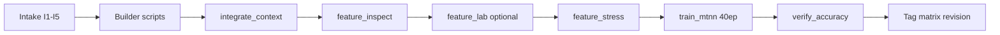

# Feature Engineering SOP — Vector Hoops MTNN

> **Owner:** AI/ML research lane · **Applies to:** `pipeline/` → `train_matrix.npz` → `train_mtnn.py`  
> **Doctrine:** No feature ships to MTNN or `assets/vectors.json` without passing inspection + stress gates below.

---

## 1. Intake (before writing code)

| Step | Action | Artifact |
|------|--------|----------|
| I1 | State hypothesis (what retrieval/game behavior improves) | Issue / VH task note |
| I2 | Cite source + join key (`name+season`, `TEAM_ID`, `PLAYER_ID`) | Script docstring |
| I3 | Define mask rule (pre-coverage, min GP, log window) | `integrate_context.py` or builder |
| I4 | Assign tower family in `V4_FEATURES` / `FAMILY_OF` | `feature_manifest.json` |
| I5 | Check overlap with existing families | `feature_inspect.py --correlation` |

**Reject without merge if:** duplicate of existing tower (see tower ablation), no defensible source, or mask <5% without documented reason.

---

## 2. Build & merge

```bash
cd vector-hoops

# Context / derived features
python pipeline/<builder>.py          # e.g. form_context.py, roster_context.py
python pipeline/integrate_context.py  # era-z append + mask

# Wide game stats (when cache healthy)
python pipeline/build_vectors.py --offline
python pipeline/integrate_context.py
```

**Gate:** `feature_manifest.json` revision logged; row count unchanged vs bootstrap unless intentional.

---

## 3. Inspection (`feature_inspect.py`)

Run after every merge:

```bash
python pipeline/feature_inspect.py
python pipeline/feature_inspect.py --correlation  # pairwise redundancy
```

| Check | Pass criterion |
|-------|----------------|
| Coverage per feature | Document % masked; context features <50% need note |
| Coverage per family | No family 100% zero-mask unless deferred |
| Era z range | All present values in [-4, 4] |
| Season coverage | Form/log features: expected 2015+ only |
| Correlation | \|r\| > 0.92 flagged — justify or drop one |
| Leakage proxy | Feature vs `season` index \|r\| < 0.85 (except career year) |

Output: `pipeline/data/feature_inspect.json`

---

## 4. Transparent 14-d ablation (`feature_lab.py`)

Before any candidate touches MTNN (optional for pure context towers):

```bash
python pipeline/feature_lab.py
```

**Gate:** `base+feature` beats `base14` on next-PMz R² without silhouette/position-NN drop >0.01.

Role standing: PASS for game copy (`roles.json`), **FAIL** for MTNN tower (redundant with roster).

---

## 5. Stress testing (`feature_stress.py`)

```bash
python pipeline/feature_stress.py           # full report
python pipeline/feature_stress.py --quick  # smoke only
```

| Test | What it does | Pass |
|------|----------------|------|
| S1 Tower ablation | Drop-one-family retrain (25 ep) | Δ test recall ≤ 0.01 to drop |
| S2 Held-out seasons | val/test recall in `train_mtnn.py` | Primary promotion metric |
| S3 Missingness stress | Zero-mask random 30% of a family | Recall drop ≤ 0.03 |
| S4 Purity floor | cross-era archetype purity@20 | ≥ 0.63 before `assets/` NN promote |
| S5 14-d baseline | MTNN vs raw game vector recall | Beat by ≥0.05 on held-out |

Output: `pipeline/data/feature_stress.json`

---

## 6. Train & promote

```bash
python pipeline/train_mtnn.py --epochs 40
python pipeline/verify_accuracy.py
```

**MTNN promotion** (embedding → game NN): all S2–S5 pass on same matrix revision.  
**`vectors.json` contract:** frozen 14-d unless operator sign-off.

---

## 7. Operating loop (mermaid)



---

## 8. File map

| Script | Role |
|--------|------|
| `feature_lab.py` | 14-d ablation gate |
| `feature_inspect.py` | Coverage, corr, leakage |
| `feature_stress.py` | Ablation + missingness stress |
| `tower_ablation.py` | Drop-one-family harness |
| `archetype_time.py` | Global prevalence + era-native K=8 |
| `archetype_era_audit.py` | Separability, purity, K-sweep per era |
| `career_trajectories.py` | Reinvention / migrator taxonomy |
| `procrustes_drift.py` | Season-pair geometry drift |
| `train_mtnn.py` | Train + held-out eval |
| `mtnn_hill_climb.md` | Iteration targets |
| `docs/ARCHETYPE_ERA_RESEARCH.md` | Archetype drift doctrine |
| `DATA_EXPANSION_WORKFLOW.md` | Data source DAG |

---

## 9. Archetype rebuild (after `build_vectors.py`)

```bash
python pipeline/procrustes_drift.py
python pipeline/archetype_time.py
python pipeline/career_trajectories.py
python pipeline/archetype_era_audit.py
```

Review `pipeline/data/archetype_era_audit.json` recommendations before MTNN retrain.

---

## 10. Current decisions (2026-07-05)

| Feature | MTNN | Game UI |
|---------|------|---------|
| Roster context | ✅ tower | — |
| Role standing | ❌ dropped (ablation) | ✅ `roles.json` |
| Form (gamelogs) | ✅ tower | — |
| Tenure | ❌ geometry fail | — |
| Salary / team / career / competition | ✅ towers | — |
