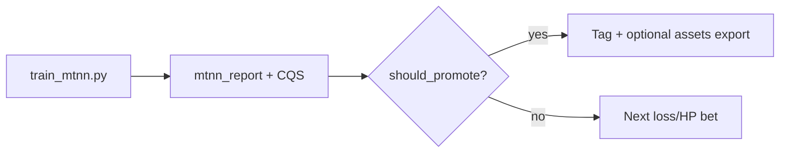

# MTNN Hill-Climb Plan

**North star:** multi-task **Composite Quality Score (CQS)** — see `pipeline/composite_score.py`.
Primary continuity signal remains held-out **recall@10**, but promote decisions also
require cross-era **purity**, skill decode R², next-profile quality, and aux-head health.

**Current champion (Bet D, 2026-07-10 — promote gate PASS):**

| Metric | Value |
|--------|-------|
| **CQS** | **85.87** (bar was 85.28 over baseline 84.78) |
| test recall@10 | 1.000 |
| purity@20 | 0.8726 |
| skills test mean R² | 0.802 |
| next_profile test R² | 0.651 |
| position head | 0.998 |

**Promote:** `CQS >= baseline + 0.5` **and** recall within −0.02 **and** purity within −0.02.
Not auto-promoted to `assets/` — run export only after an explicit promote.

---

## Operating loop (every iteration)



**Per run, always:**

1. `python pipeline/train_mtnn.py …` (checkpoint metric default `cqs`)
2. Read `composite.cqs` + `promote.reason` from `mtnn_report.json`
3. Log in `tasks/hillclimb-mtnn-cqs.md`
4. Advance only if `should_promote` is true

---

## Feature Lab track (transparent 14-d vs MTNN aux)

`feature_lab.py` ablates **game-log role features** before they touch
`vectors.json` (the player-facing contract stays 14-d):

| Feature set | Gate | Verdict |
|-------------|------|---------|
| minShare, usageShare, scoreRank | C1 next-PMz R² + C2 silhouette + C3 position-NN | **PASS** → `assets/roles.json` game copy only |
| leagueTenure, teamTenure | same | **FAIL** geometry — aux-only if ever used |
| role MTNN tower | drop-one ablation @25ep | **DROP** — redundant with roster; hurts test recall |
| salary | excluded | already in `market` tower (separate sourcing) |
| coach tenure | — | needs source (Track C) |

Role tiers (leader / key / specialist / …) ship in `assets/roles.json` for
game copy; not fused into cosine space.

---

## Phase A — Fix the data ceiling (highest ROI)

Training still uses a **bootstrap 14-d game core**. Context towers help, but wide game stats (Advanced, Scoring, Tracking, Form) are the biggest missing signal.

### A1. Unblock `build_vectors.py --offline`

| Step | Action | Expected lift |
|------|--------|-----------------|
| A1.1 | Convert legacy `base_*.json` (name-keyed dict) → `dashbase_*.json` (list w/ `PLAYER_ID`, `MIN`, `GP`, full 14-d) | Enables offline rebuild |
| A1.2 | When API returns: fetch `dashadvanced_*`, `dashscoring_*`, `bio_*`, `tracking_*` per season | +shotmix, +tracking, +bio towers |
| A1.3 | Wire `FORM_*` from existing `gamelogs_*.jsonl` | +form tower (2015–26) |
| A1.4 | Full run → `train_matrix.npz` ≥40 features; refresh `assets/vectors.json` with salary z | **Target recall +0.03–0.06** |

**Gate:** `feature_manifest.json` lists shotmix + tracking + form families; salary coverage >50% of rows masked-in.

### A2. Extend team join to all seasons

Today team features cover ~3,385 rows (roster `teamId`, 2015+ only).

| Step | Action |
|------|--------|
| A2.1 | Build `player_team_{season}.jsonl` from dash Base `TEAM_ID` when wide fetch lands |
| A2.2 | Fallback join: salary CSV `team` abbr → `TEAM_ID` map for pre-2015 |
| A2.3 | Add `PLAYER_TM_RESIDUAL` = player PM z − team net z (mtnn_v4_plan) |

**Gate:** team tower mask >80% of rows; ablation drop-team recall drop ≤0.01.

### A3. Salary depth

| Step | Action |
|------|--------|
| A3.1 | Backfill `SALARY_CAP_PCT` from team payroll / cap table |
| A3.2 | Add `SALARY_RANK_POS` (within-season rank by salary) |
| A3.3 | Name-join audit: sample 100 high-salary players, manual spot-check vs BBRef |

**Gate:** `salary_mae_z` in report; masked rows ≥10k.

---

## Phase B — Model hill-climb (same matrix, better training)

Run as **cheap experiments** (20-epoch smoke, then 40-epoch confirm on winners).

### B1. Hyperparameter sweep (fixed matrix)

| Knob | Search space | Hypothesis |
|------|--------------|------------|
| `dim` | 32, 48, 64 | More capacity helps multi-tower fusion |
| `lr` | 1e-3, 1.5e-3, 2e-3 | Lower lr stabilizes purity |
| InfoNCE temp | 0.07, 0.1, 0.15 | Sharper positives for career continuity |
| dropout view `drop_p` | 0.10, 0.15, 0.20 | Regularizes cross-era |

**Gate:** best config beats 0.784 recall on 3 seeds (7, 42, 99).

### B2. Loss rebalancing (v4 heads — partial)

Implement in `train_mtnn.py --version v4` incrementally:

1. **First:** `team_fit` head on `TM_NET_RTG` (weight 0.08)
2. **Second:** `form_recon` when form features land (A1)
3. **Third:** `bbref_bridge` when `fetch_bbref_advanced.py` cache exists
4. **Last:** chemistry contrastive pairs (Phase C)

Reduce archetype weight 0.35 → 0.25 as new heads come online (mtnn_v4_plan).

### B3. Hard-negative mining

Adjacent-season InfoNCE uses in-batch negatives only. Upgrade:

- Same-position, different-player negatives weighted higher
- Cross-era same-archetype negatives as semi-hard pool

**Hypothesis:** +0.01–0.02 recall, better purity.

---

## Phase C — Relational signal (game-mode bridges)

| Step | Source | Feature / loss |
|------|--------|----------------|
| C1 | `chemistry_analysis.py` | Teammate contrastive pairs (same team-season) |
| C2 | `tier_b_stint_parser.py` | Shared-floor proxy (not lineup on/off) |
| C3 | `fall_analysis.py` | Expectation residual as auxiliary regression |
| C4 | `fetch_bbref_advanced.py` | WS48, BPM bridge head |

**Gate:** Chemistry-mode nearest-neighbor sanity on 20 hand-picked pairs.

---

## Phase D — Evaluation rigor

### D1. Held-out evaluation

Split by **target season** (next season in adjacent pair):

- **Train:** seasons ≤2021-22
- **Val:** 2022-23, 2023-24
- **Test:** 2024-25, 2025-26

Report recall@10 on val/test only. This is the promotion number.

### D2. Transparent 14-d baseline

Compute recall@10 on raw game-feature vectors (L2-normalized). MTNN must beat this on **held-out** seasons by ≥0.05.

### D3. Tower ablation table (required each run)

| Drop family | Δ recall@10 | Pass if |
|-------------|-------------|---------|
| team | ? | ≤0.01 drop |
| market | ? | ≤0.01 drop |
| roster | ? | ≤0.01 drop |
| career | ? | ≤0.01 drop |
| competition | ? | ≤0.01 drop |

### D4. Cross-era purity recovery

Purity dropped 0.649 → 0.607 as context grew. Target **≥0.63** before game UI uses v4 NN.

---

## Phase E — Promotion (deliberate, not automatic)

Only after D1–D4 pass on the **same** matrix revision:

1. Write `embedding_v4.npz` + `"model": "mtnn_v4"` in report
2. `verify_accuracy.py` green
3. Operator sign-off on Methods limitations
4. Optional: wire `game.js` NN for Chimera/Chemistry only — **14-d profile stays** for main card display

---

## Recommended run order

| Run | Focus | Success criterion |
|-----|-------|-------------------|
| **R0** | Baseline tag | recall 0.784 logged (done) |
| **R1** | Held-out eval split | honest val/test recall in report |
| **R2** | HP sweep (dim/lr/temp) | +0.01 val recall |
| **R3** | Legacy cache converter | wide matrix builds offline |
| **R4** | Full wide + form | ≥40 features, recall bump |
| **R5** | v4 team_fit head | recall hold + team MAE |
| **R6** | BBRef + ablation | gates in mtnn_v4_plan |

---

## Defer

- **Lineup on/off (Tier C)** — PBP gated, Methods sign-off required
- **Promoting to `assets/`** — until held-out recall beats 14-d baseline by margin
- **Bigger embedding dim without wide data** — capacity without signal overfits purity
- **Re-fetching team seasons via API** — 30/30 already cached

---

## Quick reference

```bash
cd vector-hoops

python pipeline/integrate_context.py
python pipeline/train_mtnn.py --epochs 40
python pipeline/verify_accuracy.py

# When API healthy — unlock wide matrix
python pipeline/build_vectors.py          # or --offline after A1
python pipeline/integrate_context.py
python pipeline/train_mtnn.py --epochs 40
```

**Summary:** Next big step is **R3/R4 (wide matrix via `build_vectors`)**. Model tweaks (R1–R2, R5) are cheap wins while data work unblocks the ceiling. Target **0.80+ held-out recall@10** and **purity ≥0.63** before touching the live game contract.

See also: `mtnn_v4_plan.md`, `docs/DATA_EXPANSION_WORKFLOW.md`.
