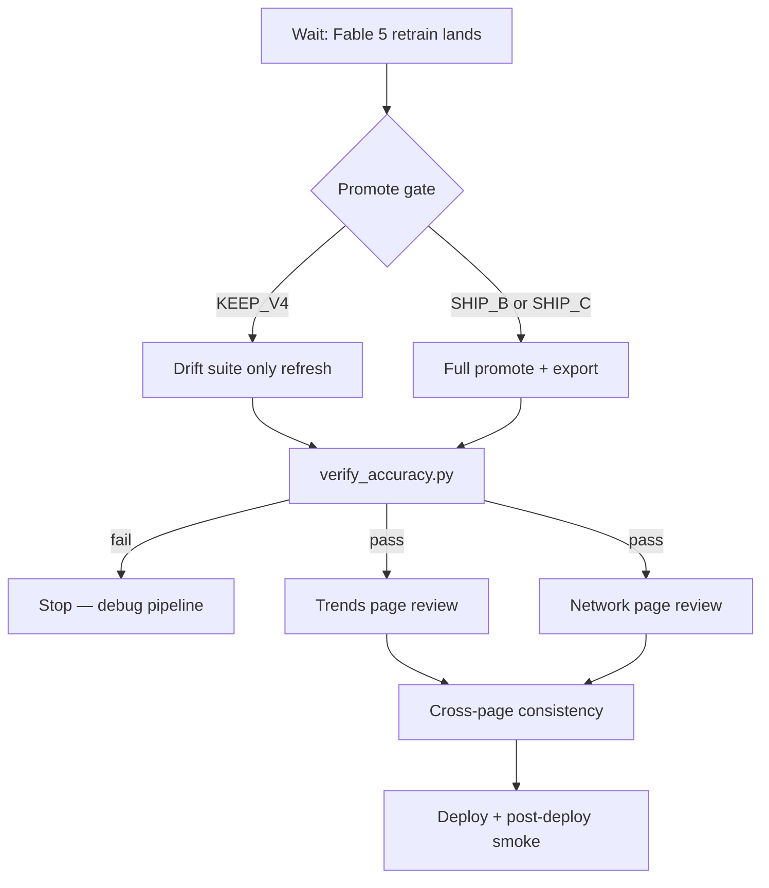

# Post-retrain review — Trends + Network Explorer

> **Created:** 2026-07-09 · **Trigger:** Fable 5 final retrain + promote gate clears  
> **Monologue:** `python scripts/read_session_monologue.py --format context`  
> **Gate doc:** `docs/MTNN_V5_PROMOTE_GATE.md`  
> **Hard rule:** Do not review against stale `assets/` until operator promotes OR `retrain_universe.py` / `export_assets.py` has finished and `verify_accuracy.py` is green.

---

## 0. Where we are (live)

| Lane | Status (terminal 51 / monologue) |
|------|----------------------------------|
| Data repair | Salary backfill 2018–25 done |
| Leak-free eval | B (deep concat) beat v4 on next-season prediction |
| In flight | 11-config HP sweep → train_matrix rebuild → final train |
| Product | Trends + `/model` copy/readability pass shipped; awaiting new embeddings |

**Review starts when:** `mtnn_report.json` has final metrics **and** either (a) operator says promote, or (b) `export_assets.py` + `export_mtnn_viz.py` have refreshed client assets.

---

## 1. Dynamic workflow (phases)



### Phase A — Wait & snapshot (now → retrain done)

- Poll monologue / terminal 51; do **not** edit `pipeline/train_mtnn.py` (Fable 5 lane).
- When sweep table lands, paste into `docs/MTNN_V5_PROMOTE_GATE.md` §2.
- Record pre-promote asset fingerprints (`assets/manifest.json` built timestamps, `mtnn_report.json` metrics).

### Phase B — Promote decision (operator gate)

- Circle §7 outcome: `SHIP_C` · `FALLBACK_B` · `KEEP_V4`.
- **Default:** no overwrite of `mtnn_best.pt`, `embedding_v3.npz`, `assets/mtnn_*` until explicit yes.
- If `KEEP_V4`: run drift-only path (`rebuild_drift_suite.py --skip-skills`); skip MTNN viz re-export unless embeddings unchanged.

### Phase C — Pipeline refresh (after promote yes)

Ordered commands (match `retrain_universe.py` tail):

```powershell
cd c:\Users\jcdav\vector-hoops
python pipeline/retrain_universe.py --skip-build   # if vectors already fresh
# OR, if only drift + export needed:
python pipeline/rebuild_drift_suite.py --full
python pipeline/export_assets.py
python pipeline/test_mtnn_export.py
python pipeline/verify_accuracy.py
```

**Trends assets produced:** `drift.json`, `archetypes_time.json`, `archetype_emergence.json`, `trajectories.json`  
**Network assets produced:** `mtnn_arch.json`, `mtnn_map.json`, `mtnn_heads.f32`, `mtnn_inputs.f32`, `vectors.json` (row alignment)

### Phase D — Automated gates (cheapest correctness)

| Gate | Command | Blocks review if |
|------|---------|------------------|
| Drift row alignment | `rebuild_drift_suite.py` local verify | `n_players` mismatch |
| MTNN export | `test_mtnn_export.py` | dim ≠ 48, purity < 0.63, row count |
| Full suite | `verify_accuracy.py` | procrustes orthogonality, client f32 size |
| Viz export smoke | `pipeline/test_mtnn_export.py` + manual fetch | 404 on `assets/mtnn_heads.f32` |

### Phase E — Trends page review (`/trends`)

See `tasks/todo.md` § Trends. Focus: data–copy alignment after retrain, court by-era baselines, emergence claims vs evidence.

### Phase F — Network page review (`/model`)

See `tasks/todo.md` § Network. Focus: architecture truth (tower count, head outputs), embedding map PCA axes, flow trace vs Jacobian if exported, skill grade scale, next-profile head.

### Phase G — Cross-page consistency

- Archetype names/colors: `archetypes_time.json` global list ↔ `mtnn_arch.json` gameArchetypes ↔ `vectors.json` clusters.
- Era bands: `ARCHETYPE_ERAS` in `drift.js` still cover all seasons in `drift.json`.
- Footer metrics on `model.html` match `mtnn_report.json` (update copy if promote changes numbers).
- Long careers: search Tim Duncan / LeBron — all seasons visible in network search.

### Phase H — Deploy & smoke

```powershell
vercel --prod --yes
curl.exe -s https://hoops.jcamd.com/trends -o NUL -w "%{http_code}"
curl.exe -s https://hoops.jcamd.com/model -o NUL -w "%{http_code}"
```

Browser pass: season slider, court era tabs, network play flow, compare mode, time scrubber, node inspector.

---

## 2. Asset → UI map

### Trends (`trends.html` + `trends-viz.js` + `drift.js`)

| Asset | UI surface | Retrain sensitivity |
|-------|------------|---------------------|
| `drift.json` | Rotation chart, biggest shifts, story viz, method quote | High — procrustes on new universe |
| `archetypes_time.json` | Stream chart, era panels, **court heatmap** | High — MTNN era clusters + zoneMix |
| `archetype_emergence.json` | Verdict, role chart, claims pills | Medium — audit script thresholds |
| `trajectories.json` | Career shapes, motif flow | Medium — path classification |

### Network (`model.html` + `network-viz.js`)

| Asset | UI surface | Retrain sensitivity |
|-------|------------|---------------------|
| `mtnn_arch.json` | Layer diagram, tower families, head defs | **Critical** if v5 ships |
| `mtnn_map.json` | 3D PCA coords, axis labels | High — embedding geometry shifts |
| `mtnn_heads.f32` | Archetype / skill / next-profile outputs | High |
| `mtnn_inputs.f32` | Input family strengths, flow animation | Medium |
| `vectors.json` | Player list, season tags, cluster colors | Row count + names |
| `mtnn_jacobian.*` (optional) | Causal trace hints | Only if export run |

---

## 3. Review rubric (what “good” looks like)

### Trends

1. **Honest claims** — emergence verdict supported by `archetype_emergence.json` claims array; no copy implying causation.
2. **Era court map** — by-era mode diffs vs prior era (first vs today); zones visibly change when switching tabs; no flat all-zero court.
3. **Story viz** — slider + chips match `drift.json` pairs; compass shows background seasons; stat narratives reference real `statInsights`.
4. **Readability** — no leaked jargon (K=8, silhouette, logits) in user-visible strings post-deslop pass.

### Network

1. **Architecture fidelity** — step captions match `mtnn_arch.json` (tower count, fusion type, head list).
2. **Prediction sanity** — no skill grades at exactly 100; decimals where needed (`fmtPredScore`).
3. **Trace coherence** — clicking input → tower → head highlights consistent path; inspector values match output panels.
4. **Embedding context** — nearest neighbors are plausible (same era/archetype mix); compare mode distances sensible.
5. **Career completeness** — time scrubber shows full career for 15+ season players.

---

## 4. Risk register

| Risk | Mitigation |
|------|------------|
| Promote before 3-seed confirm | Hold per `MTNN_V5_PROMOTE_GATE.md` §2b |
| Embedding dim 48 → 64 | Grep `48` in `network-viz.js`, `export_mtnn_viz.py`, PCA export |
| Leak-free metrics lower headline numbers | Update `model.html` foot + methods copy; do not restore old recall |
| Fable 5 edits conflict with product lane | `git status` radar; don't touch `train_mtnn.py` |
| Stale Vercel alias | Verify direct deploy URL then `hoops.jcamd.com` |

---

## 5. Deliverables

- [ ] Filled `docs/MTNN_V5_PROMOTE_GATE.md` §2 comparison table
- [ ] Completed `tasks/todo.md` checklist with pass/fail notes
- [ ] Readiness report (metrics, verify commands, deploy URL)
- [ ] Optional: `tasks/post-retrain-review-notes.md` with screenshots / known issues

---

## 6. Changelog

| Date | Note |
|------|------|
| 2026-07-09 | Initial plan — Fable 5 HP sweep in flight |
